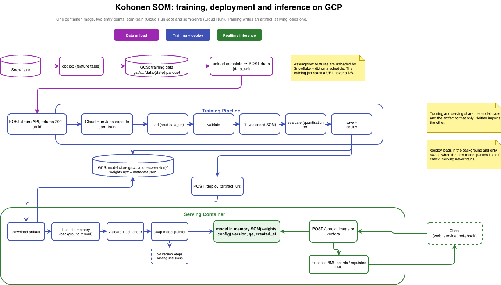

# Kohonen SOM review


A code review of a Self-Organising Map implementation, with recommendations. The
code under review is in `original/kohonen.py`, untouched.

The rest of this repo is that code taken to production: the same algorithm rewritten
to be fast, tested and packaged, split into a training pipeline that produces a model
artifact and a service that loads one, with a Dockerfile and CI around it. Each of the
five recommendations below points at the part of the repo that demonstrates it.

```
original/kohonen.py       the code under review
src/som/
  model.py                SOM, SOMConfig
  store.py                artifact format (weights.npz + metadata.json)
  training/               pipeline + `python -m som.training`
  serving/                FastAPI app + schemas
tests/
benchmarks/compare.py
Dockerfile
.github/workflows/ci.yml
```

## Top 5 recommendations

### 1. Vectorise the update loop

**Problem:** the BMU lookup is already vectorised (`np.argmin(np.sum(...))` over the whole
grid), but two lines later the weight update drops into a `for x: for y:` loop and touches
every node one at a time. On the 100x100 / 1000 epoch case that's 10k nodes x 10 samples x
1000 epochs = 100M trips through the Python interpreter to do a subtract and a multiply.
I measured it at ~3.5 min on my laptop.

**Fix:** precompute a `(W, H, 2)` array of node coordinates once. Then distance-to-BMU for
every node is a single subtraction, theta is a single `exp`, and the update is a single
broadcast. Same maths as before, just no Python loop.

```python
coords = np.stack(np.meshgrid(np.arange(W), np.arange(H), indexing="ij"), axis=-1)  # once

for v in X:
    d2_feat = np.sum((weights - v) ** 2, axis=-1)                   # (W, H)   unchanged
    bmu = np.unravel_index(np.argmin(d2_feat), d2_feat.shape)
    d2_grid = np.sum((coords - bmu) ** 2, axis=-1)                  # (W, H)   was the loop
    theta = np.exp(-d2_grid / (2 * sigma**2))                       # (W, H)
    weights += alpha * theta[..., None] * (v - weights)             # (W, H, F)
```

```
$ python benchmarks/compare.py

10x10 grid, 100 epochs       original     0.21s   vectorised   0.010s   speedup     21x   identical: True
100x100 grid, 1000 epochs    original   204.06s   vectorised   2.140s   speedup     95x   identical: n/a (extrapolated)
```

`tests/test_equivalence.py` runs both versions from the same starting weights and checks
the outputs match to 1e-12, so this is a pure speedup with no behaviour change.

Files: `src/som/model.py` (`fit`), `benchmarks/compare.py`, `tests/test_equivalence.py`

### 2. Validate inputs, seed the RNG

**Problem:** no validation anywhere. Pass a 2x2 grid and sigma0 = 1, log(1) = 0, lambda
divides by zero. Pass anything that isn't 3 features and it breaks because the 3 is
hard-coded. Nothing is seeded so you can't reproduce a run, and the `__main__` block
regenerates the data between its two calls, so the two PNGs aren't even trained on the same
inputs.

**Fix:** `SOMConfig` validates on construction (grid size, learning rate, radius, and the
sigma0 <= 1 case). `fit()` refuses non-2D / empty / NaN input. There's a `seed` argument
that feeds `default_rng`. Feature count comes from `X.shape[1]`.

Files: `src/som/model.py`, `tests/test_model.py`

### 3. Make it a module, not a script

**Problem:** it's one function. You can't import it without also importing matplotlib. Once
you've trained you get a raw array back and that's it - no way to ask "which cell does this
new point land in", no save, no load. And the Greek variable names are cute but nobody can
type or grep them.

**Fix:** a `SOM` class: `fit`, `transform` (BMU coords for new samples), `quantization_error`,
`save`/`load` (one .npz, config + weights, no pickle), `to_image`. matplotlib is an optional
extra. Installable, typed, docstrings.

Files: `src/som/model.py`

### 4. Tests, and an actual quality metric

**Problem:** zero tests, so any change is a gamble. And the only way to know if training
worked is to open the PNG and squint.

**Fix:** 37 tests. Config edge cases, reproducibility, non-RGB input, convergence on a single
point, save/load round trip, the pipeline, the API. The one I care most about is the
equivalence test against the original, because it's what let me do #1 without worrying.
Quantisation error (mean distance from each sample to its BMU) gets computed after every
training run and written into the artifact metadata.

Files: `tests/`

### 5. Split training from serving

**Problem:** `__main__` trains, plots, exits. The model doesn't outlive the process. There's
nothing you could deploy, version, or monitor.

**Fix:** two entry points that share the model class and an artifact format, nothing else.
`python -m som.training` is the batch job: load, validate, fit, evaluate, save. Each step is
a plain function so it drops into whatever orchestrator you've got. It writes `weights.npz` +
`metadata.json`. The FastAPI service loads that at startup and serves `/map`. It never trains.
`/train-job` is a stub that would submit the job in a real deployment. One Docker image,
default command serves, override it to train. CI builds the image, runs a training job in it,
starts the server against the output and curls `/map`.

Files: `src/som/training/`, `src/som/serving/`, `src/som/store.py`, `Dockerfile`, `.github/workflows/ci.yml`

## How I'd productionise it



- **Training job**: scheduled or triggered via `/train-job`. Runs the pipeline in the
  same image, writes the artifact to a model store.
- **Model store**: object storage or a registry. Versioned. Locally it's a directory.
- **Serving**: loads the latest artifact at startup. `transform` is one matrix op over
  the grid. Horizontally scalable; a redeploy picks up a new model.
- **Monitoring**: quantisation error on fresh data vs. the value in `metadata.json`.
  Drift past a threshold triggers a retrain.

Next steps, not built here: a real job runner behind `/train-job`, a model store client
instead of a directory, hot reload or polling for new artifacts, structured logging with
request ids, metrics export, and a size limit on `/map`.

## Running it

```bash
pip install -e ".[dev]"
pytest
python benchmarks/compare.py

python -m som.training --width 10 --height 10 --epochs 100 --seed 0 --out artifacts
SOM_ARTIFACT_DIR=artifacts uvicorn som.serving.app:app
curl localhost:8000/health
curl -X POST localhost:8000/map -H 'content-type: application/json' -d '{"data":[[0.1,0.2,0.3]]}'

docker build -t som .
docker run --rm -v ./artifacts:/artifacts som python -m som.training --width 10 --height 10 --out /artifacts
docker run --rm -p 8000:8000 -v ./artifacts:/artifacts som
```
